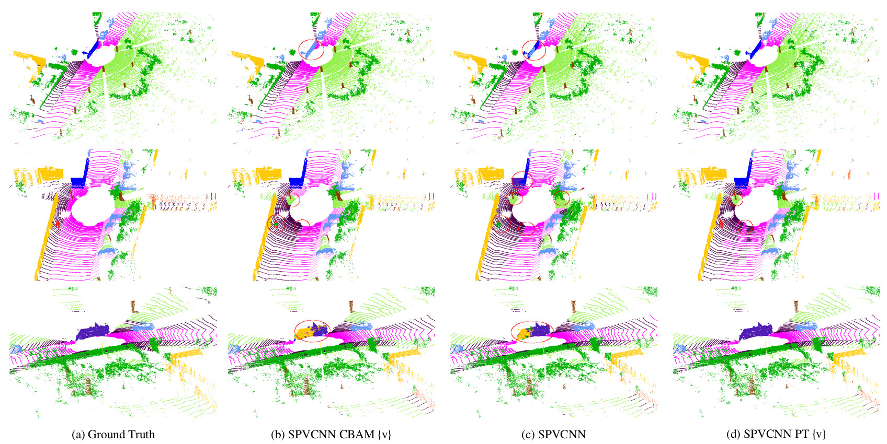
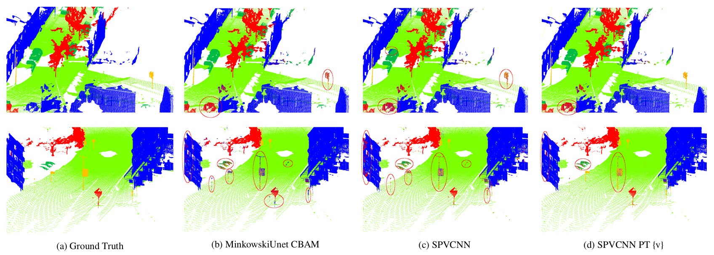

# Improving performance of deep learning models for 3D point cloud semantic segmentation via attention mechanisms
This is the official implementation of "Improving performance of deep learning models for 3D point cloud semantic segmentation via attention mechanisms" paper

Our implemented network "SPVCNN with Point Transformer in the voxel branch", achieves State Of the Art Results in Street3D dataset

## Install

1. Construct an anaconda environment with python 3.9.7
2. Install pytorch 1.10
  '''
  “conda install pytorch==1.10.0 torchvision==0.11.0 torchaudio==0.10.0 cudatoolkit=11.3 -c pytorch -c conda-forge”
  '''

```
git status
git add
git commit
```
